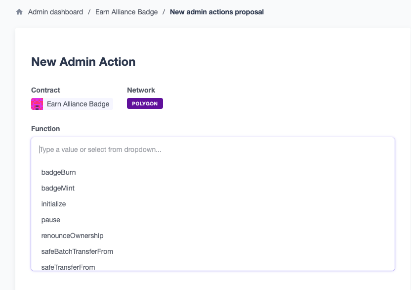
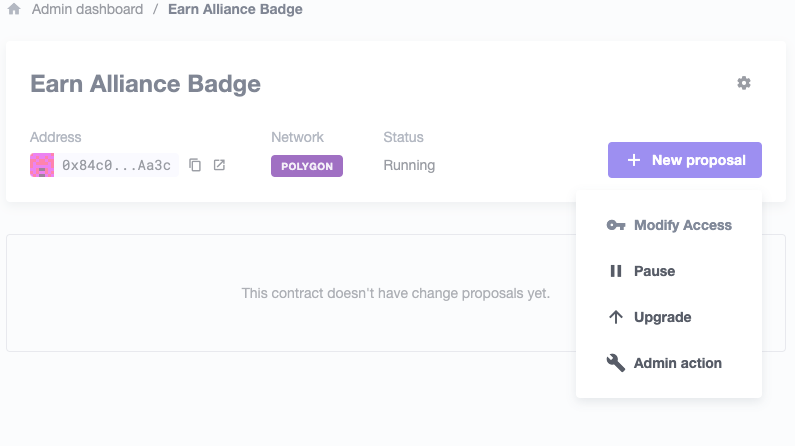
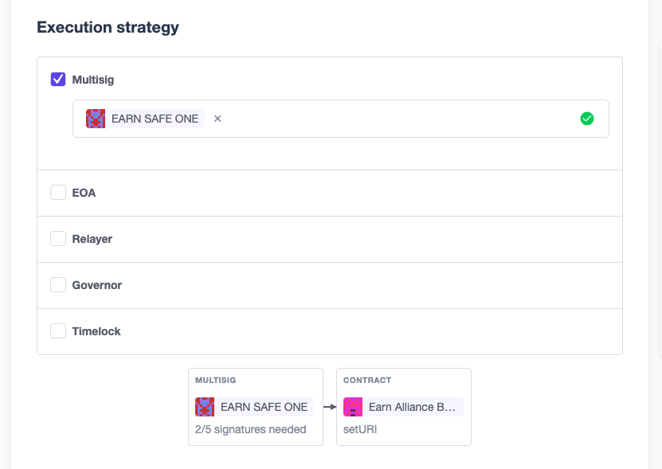

# Documentation for EA Badge

### Important Addresses

_Last update 28 MAR 2024_

#### Current Badge Testnet and Mainnet addresses

Mainnet (proxy): `0x84c0151F4Ecf1b36346C5EB4122dd5dF9701Aa3c`
Testnet (mumbai) (proxy): `0xXXXXXXXXXXXXXXXXXXXXXXXXXXXXXXX`

#### Defender Multisig Addresses

Mainnet: `0x459EEAbA1311f54314c8E73E18d6C2616883af8c`

[Go to Mainnet Multisig in Defender](https://defender.openzeppelin.com/#/admin/contracts/matic-0x459EEAbA1311f54314c8E73E18d6C2616883af8c)

Testnet (mumbai): `0xXXXXXXXXXXXXXXXXXXXXXXXXXXXXXXX`

[Go to Testnet Multisig in Defender](https://defender.openzeppelin.com/#/admin/contracts/mumbai-0x2C303A251E6B28A20AfB7eACfa1D53AEf80aeB5E)

### Find out Size of contracts

They must be 24kb or less, so consider calling this after any updates. First iteration was around 22.7 KB
`yarn run hardhat size-contracts`

### Deploy Contract initially

Initial deployment can be accomplished by using one of the deployment scripts. There are deployments available for testnet and mainnet.

One note ahead of time is to make sure that you are deploying from the address that you would like to use for the signer key. The public key for your address should be noted in the env file (in the env file, for mainnet signer key is pulled from `PROD_SIGNER_PUBLIC_KEY`, for testnet `TESTNET_PUBLIC_KEY`). Whatever you launch with will be the key that can be used to sign (or approve) that a badge may be minted, so choose wisely. It doesn't have to be the deployment address, this has just been an easy route, it just needs to be a public key from a wallet address.

####Script to deploy:
mainnet:
`npx hardhat run --network mumbai scripts/metaBadgeDeployMainnet.js`

testnet (currently mumbai):
`npx hardhat run --network mumbai scripts/metaBadgeDeployTestnet.js`

It should give a proxy address in the readout. Save this as it will be important for follow on steps as well as generally.

### Verification of proxy and implementation contracts after

Use the following script in the root folder to verfy any contract in the project.. this works for proxies too.
`npx hardhat verify 0xADDRESS2VERIFY1234567890tyhjkoi8765 --network polygon`
Verification is useful to see the code on polygonscan, and required to import it into defender

Related:
If you'd like to verify the implementation as well as the proxy and easy script to grab the address is the following:
`npx hardhat run --network polygon scripts/impl.js`

This is not the only way to do it, just a helper script :). After that, you can verify it using the same script as above that was used for the proxy (though of course, save the address).

Now both your proxy and implementation can be read a blockexplorer, so you should be able to see them on polygon scan under the #code tab, and Open Zeppelin Defender can read them too (the latter being important for the next step).

### Locating the ABI

Getting the contract's ABI after deployment is useful. There are a few methods to do this.

#### in project

Go to `.openzeppelin/`, there is a file that corresponds to any deployed contract in this file. `CTRL + F` for `ABI` and you should find a array in the json that corresponds to the ABI. Copy everything within the array and you have your ABI.

#### solc

[Ok, highspeed, Follow these instructions..](https://ethereum.stackexchange.com/a/42603/68000)

#### helpful past developer

There was an ABI folder made at the root folder level, that, when deployed a developer that deployed it can manually make a copy of the ABI for safekeeping. That hasn't happened with the current versions on the net, but hopefully a functionality will be added to do this for ease of use at a later date.

### Polygon Gas Limit is currently 30M per block.

https://www.coinbase.com/cloud/discover/protocol-guides/guide-to-polygon#:~:text=Polygon%20PoS%20offers%20high%20throughput,maintaining%20high%20standards%20of%20security.

An airdrop to 20 addresses costs about 318,510 gas (as of 8FEB2023, that's about $0.32 USD):
https://polygonscan.com/tx/0x64f9a8924333ea37c5b92ad4410bbca58cc61675be45dd2f7d3ab7fc0f6ceb44
Note that some of these addresses didn't execute b/c they had the badge already.

If you wanna do more than 100 addresses or just use a CSV, I suggest app.safe.global and it's CSV Airdrop tool. To add commas to a list of addresses, (this tool works well))[https://convert.town/column-to-comma-separated-list]

### What is Defender, and Why are we using it?

[OpenZeppelin Defender](https://docs.openzeppelin.com/defender/) provides a security operations (SecOps) platform for Ethereum with built-in best practices. Development teams implement Defender to ship faster and minimize security risks.

We're using this platform so that we:

- can have a friendlier UI/UX for contract upgrades, pausability and various admin actions
- take advantage of their implementation of GnosisSafe's so that we can do 2 of 5 signatures for any upgrades
- token admin actions will also require 2 of 5 signatures from company participants

The web app allows for much more intuitive/smoother usage (especially for less technical employees) so that actions that would normally require command line interface interaction and often none at all, without sacrificing the fundamental decentralization and sovereignty of our smart contract. We still own the keys (collectively) and can exit Defender to do all of these things manually at any point we chose.

Highly recommend poking around the user interface to understand what it does for us as contract operators... the UI/UX does a good job of telling you what capabilities are available!

### Importing Contract into Open Zeppelin Defender

Before we transfer ownership it's important to import the contract into OZ Defender such that it shows up in your admin screen and knows that it exists.

To do this, click the Add Contract button. Then follow the prompts like creating a name for the contract, selecting the network, entering the address, and adding the ABI. After that

[Good Reference Material for Importing Contracts to OZ Defender](https://docs.moonbeam.network/builders/build/eth-api/dev-env/openzeppelin/defender/#importing-your-contract)

### Transfer of ownership of the contract to OZ Defender

The 1.5 minute video actually walks one through almost this exact process really wonderfully. The only difference would be that instead of tranfering it to a Timelock you should transfer it over to the Multisig that's been created. One further note is that an EOA is a "Externally Owned Account" so basically the wallet that owns the contract once it has been deployed.
[Good Reference Material for transfering ownership to Defender from an EOA](https://www.youtube.com/watch?v=cXDp2n5al7U)

### Upgrade Process Walk Thru

Since we transferred control of upgrades (ownership of the ProxyAdmin) to our multisig, we can no longer simply upgrade our contract. Instead we need to first propose an upgrade that the owners of the multisig can review and once reviewed approve and execute the proposal to upgrade the contract.

#### Current Process (USE THIS TO UPGRADE YOUR CONTRACT!)

So this process uses the `metaBadgeUpgrade.js` script located in the `/scripts` folder. Please note that it is the script used for both `mainnet` and `testnet`, such that you need to pay attention to what network you are on when you call the script and also change the `proxyAddr` to the correct network's proxy address.

Things to modify on script before running:

- Change `proxyAddr` to the correct network proxy address
- Change the `oldContractStr` and `contractStr` to the appropriate names. SO if you are currently using `earnAllianceBadgeV5` and you'd like to upgrade to `earnAllianceBadgeV6` you would put the former as the `oldContractStr` and the latter as `contractStr`. This isn't cosmetic, it is necessary for the script to run correctly.
- make sure to use the correct network when typing out the command in terminal.. both are provided for you in comments above.
- If you haven't shipped a contract from the local environment you're in (or possibly if you didn't ship the most recent upgrade), you need to uncomment the lines regarding `forceImport` functionality. This will force the previous contract to exist in your local directory which is useful for the upgrade. Imporantly, _THIS CAN CAUSE PROBLEMS IF YOU ALREADY CONTRACT EXTANT IN YOUR LOCAL ARTIFACTS, CACHE ETC_. So, please don't leave it uncommented if you don't need to.

Once you've changed the above to your proper version and network that you are upgrading to, you should run the script with the commands listed near the top, example of testnet command: `npx hardhat run --network mumbai scripts/metaBadgeUpgrade.js`

This will likely ship the next iterations implementation address, but it may also error-out or have an exception. Not pretty 😕. That's ok though, because the contract cleared and there is a very easy way to go to the defender UI and upgrade the contract with an AdminAction.

Note what the implementation address is. If you don't wanna find this in the output you get back from the script, you can always check the wallet you are deploying from on PolygonScan, it will show if the contract shipped after a few min, and you can follow the link for its address.

Copy that and go make an Admin Action in the contract corresponding to the network you're upgrading in OZ Defender. There's documentation for this general process elsewhere in this doc, search for "admin action".

Select the `upgradeTo` admin action / function and it will ask for the `newImplementation` address. Copy the new address from above into that field. Pick the mutlisig that you'll be using (corresponding to the network you're on as well!) then add a Title and a Description for the proposal you are sending to your multisig peers.

**NOTE: Make sure to number the proposal, by either version or general proposal number.. as order matters when approving proposals**

Submit the proposal when you've filled all of this out. It is fairly likely to show something like "transaction invalid" or an error like this. This is a weird quirk with the polygon network. The official advice from OZ/Polygon is "wait a few hours and try again"..... so do that and it will often clear.

After that you just need an appropriate amount of the multisig signers to approve the proposal and then, when signer threshold has been hit, someone to execute!

#### Deprecated Process

###### This process consistently ends with a Bytecode verification requirement.. which we've had a hard time getting past, so use the former section's process instead. It's not as pretty but it works effectively.

To do this we use the Hardhat Defender Plugin, which is implemented in the config file, and used in the proposeUpgradeMainnet/Testnet scripts as well.

To Start an Upgrade:

- Finalize the Contract changes
- Run the script to propose an upgrade, for mainnet: `npx hardhat run --network polygon scripts/proposeUpgradeMainnet.js`
- multisig owners can review and approve new contract upgrade (this can be done in the Defender Web App)
- Once the appropriate number of owners have approved the upgrade it will be implemented!

If there are any questions from this description, [this is a great resource](https://docs.openzeppelin.com/defender/guide-upgrades#propose-the-upgrade) where most/all of this detail comes from.

### Make a multisig account in Defender

So if for whatever reason we'd need to make another multisig account in Defender [these instructions and video](https://docs.openzeppelin.com/defender/admin#creating_a_gnosis_safe_multisig_from_defender) are spot on. They are good enough that it is not beneficial to elaborate further here.

### Add a Owner to the Multisig Wallet or Change the Threshold in Defender

This can be done using the admin actions in the Defender Web App. The explanation of how to do Admin Actions is located under the [Actions that can be taken via Defender UI](#Actions-that-can-be-taken-via-Defender-UI) section.

The function you should use is `addOwnerWithThreshold`, where you add the new owner's address as the first parameter and the threshold desired as the second parameter.

If you want to change the threshold you can use the function `changeThreshold`. The only parameter for that function call is the threshold parameter.

### Upgrade Process without Open Zeppelin Defender

THere is an Upgrade script if you haven't yet migrated over to Defender. It has been lightly used and not heavily tested, but it should work.  
This is the command script:
`npx hardhat run --network mumbai scripts/metaBadgeUpgrade.js`

This might be useful if you launch a new contract and want to add something quick before you transfer contract ownership over to Defender.

### Actions that can be taken via Defender UI

Defender enables a GUI for the contract and its functions. So to upgrade or do any other administrative action for the contract one can click on the appropriate contract (as of writing the EA Mainnet Badge is labeled as `Earn Alliance Badge`)

Once there you have the ability to create a new proposal, with options like: Pause, Upgrade, and Admin Action. It should look like the below image.

You can click on any of these and follow the prompts to make a proposal to the multisig. Currently the mainnet multisig requires 2 of 5 owners to approve a proposal. So once a proposal is submitted at least one more person with ownership privileges must approve it before it will go through.

Admin Actions are probably the most interesting and certainly the most customized to us, we'll run through what one might look like quickly below.

First you click on the New Proposal button, then choose Admin Action from the dropdown.
Pick the function you'd like to perform:

Choose Multisig as your preferred execution method, then using the dropdown add "EARN SAFE ONE" (if on mainnet and using that 2 of 5 contract as the multisig)

Now you need only give the proposal a title and describe it, then press the "Create admin action" button. Thereafter it will show up in you and everyone else in the multisig's Proposals located on their main admin screen (home).

Important Note: you must also go and approve it, even though you made the proposal.

[Good Reference Material for taking OZ Defender Actions](https://docs.moonbeam.network/builders/build/eth-api/dev-env/openzeppelin/defender/#create-a-contract-proposal)

### Explanation of Defender Setup

Defender is set up presently as a 2 of 5 multisig wallet. This means any proposal or upgrade needs any two of the owners approval before it passes.

This includes pausing, changing the threshold for proposals passing, adding owners, and any other Admin Action.

[Documentation on Multisig wallets](https://docs.openzeppelin.com/defender/admin#multi-signature-wallets)

### Notes on Tests

Run via the command `npx hardhat test`

located in the `/test` folder, filename `test-EABadge.js`.

A current successful run should look something like this:

EA Badge Contract
✓ Should request a mint successfully
✓ Mint should fail if digest is invalid
✓ Checking Total Supply
✓ Cannot mint to metabadge contract
✓ Cannot mint badge to null address
✓ Can change Max supply
✓ Cannot mint when maxSupply has been reached
✓ Cannot mint two badges to one address
✓ Airdrops to multiple addresses
✓ Airdrop doesn't repeat
✓ Airdrop respects maxSupply at function level
✓ Non-Owners Cannot Transfer
✓ new2

Multicall on polygon, used in multicall test `0xa1B2b503959aedD81512C37e9dce48164ec6a94d`

### Misc (random notes that I saved during development that may be useful/relevant in future)

#### Compile error in polygon scan verification

Tried `npx hardhat verify <address implementation> --network polygon`
Got a build-info error when verifying contract. https://ethereum.stackexchange.com/questions/121176/error-when-trying-to-verify-contract
Great success.

#### details on the verify functions, specifically looked at \_signTypedData

https://docs.ethers.io/v5/api/signer/#Signer-signTypedData

#### Hardhat toolbox add

https://ethereum.stackexchange.com/a/120986/68000

#### OpenSea Metadata for contract

OpenSea requires a contractURI function to populate the NFT with data at a collection level in addition to the per NFT metadata. The documentation for how to form the metadata appropriately is here: https://docs.opensea.io/reference/collection-model

#### NFT Metadata Example

There is an example of what the metadata for a badge can look like located at this path: `/earn/metadataExample.json`
